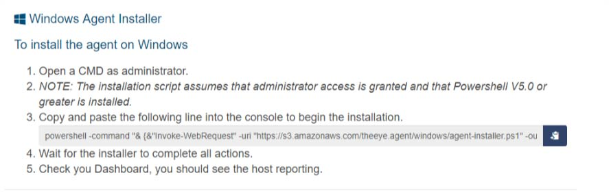

# TheEye Bot

An **Agent** is an autonomous software installed on an **Organization** **Host**, it is also known as Bot.
It main responsibility is to execute **Tasks** and complex **Workflows** and report the execution result back to the **orchestrator**.
It also report the **Host** status and health \(aka: **Health Monitor** or dstat\) to the **orchestrator**.
The **Agent** works as interface and comunication between the Host and TheEye Core

The recommenden is to install and configure the Agent as Service/Daemon.

## Getting started

From the web panel ([settings -> installer](https://app.theeye.io/dashboard#installer)) you can download the binary agent and get the installation script for your host.

## Linux Bot Installer

At this moment the supported distributions by the instalation script are

The Bot is fully funtional in:

    - Redhat/Centos 6+

    - Ubuntu 12+

NOTE: 

    - The installation script assumes that root access is granted.
    - It should works out of the box on every Linux with a kernel version 3.x+. For Linux with Kernel 2.x could require aditional actions.

### To install the Bot on Linux

***Manual Instalation from sources***
Check the documentation.

## Windows Bot Installer

NOTE: 

    - The installation script assumes that administrator access is granted
    - Powershell V5.0 or greater is installed.

If you need to debug, develop or if you prefer the manual installation of the agent, keep reading.

### To install the Bot on Windows

## Docker Bot Installer

### To run a Docker version of the Bot

## AWS Bot Installer

### To install the AWS Bot

