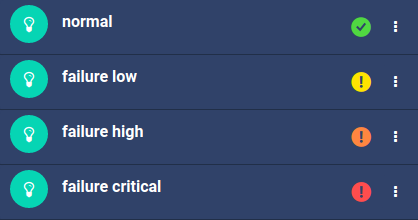
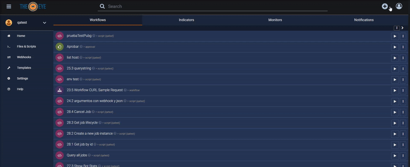

# Indicadores

[](https://theeye.io/en/index.html)

Los indicadores son una herramienta que te permite tener información de todo tipo al alcance de la mano. Estos pueden contener todo tipo de información, la cual puede ser editada programáticamente.

## Tipos de indicadores

Hay varios tipos de indicadores, cada uno con su propósito específico:

* **Chart:** Un gráfico de [Plotly](https://plotly.com/graphing-libraries/). El valor del indicador debe corresponder al parámetro `data` que se le cargaría a un componente cualquiera de Plotly. De momento, no se pueden visualizar en la interfaz de TheEye. 
* **Counter:** Un valor numérico simple. Ejemplos de uso incluyen un contador de ejecuciones, el resultado de una operación, entre otros. El valor se muestra en la interfaz.
* **Progress:** Un valor numérico entre 0 y 100, para indicar progreso. El valor se muestra en la interfaz en forma de una barra de progreso, la cual cambia de colr dependiendo el [estado del indicador](#estado).
* **Text:** Un valor de alfanumérico en el que se puede escribir cualquier palabra o frase. El valor se muestra en la interfaz al igual que el Counter

## Estado

Los indicadores también cuentan con un estado. Gracias a este, puede hacer que sea más sencillo notificar a los usuarios de errores en la ejecución de tareas. Hay 2 estados para un indicador: `normal` y `failure`, y cada indicador tiene configurada una *severidad* para indicar qué tan grave es un estado de failure, indicado en el color del ícono



> **NOTA:**
> 
> * En los indicadores de tipo *Progress*, la barra de progreso cambia de color junto con el ícono de severidad. Si el ícono es verde (indicando un estado normal), el color de la barra de progreso también será verde. 

## Crear un Indicador

Puede crear un Indicador desde el dashboard haciendo click en el botón **+**.




## Indicador tipo Text HTML.

Es posible inyectar templates HTML en el campo value de un indicador tipo text para generar indicadores con información mas compleja en formato de tablas, reportes.

### Botón Launch Task

Para lanzar una tarea desde un botón se puede utilizar el siguiente template HTML. Tener en cuenta cambiar los valores de arguments y task id de acuerdo a su entorno.

```html

<button data-hook="launch-task" data-task-id="616dbf5f6591d64cec86f954" data-task-arguments='["arg1","arg2","arg3"]' class="btn btn-default">Ejecutar Tarea</button>

```
