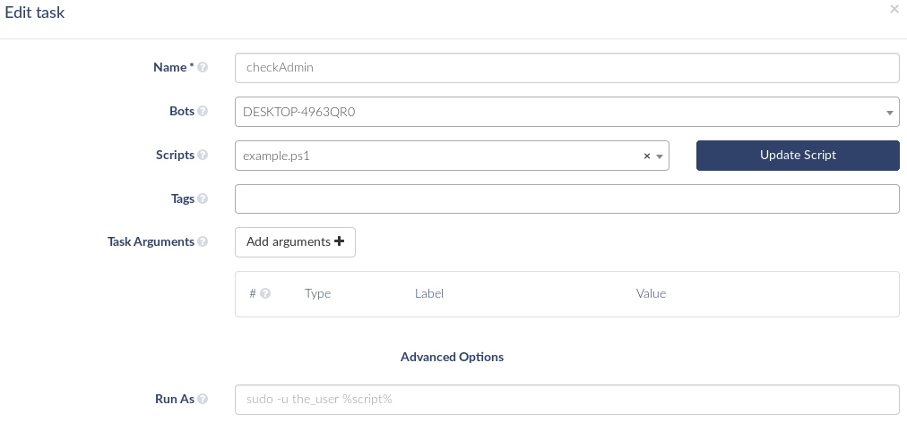
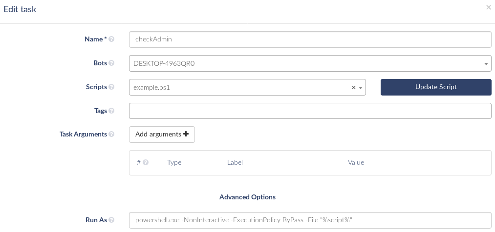

# Ejecutar Scripts y asignar permisos

[](https://theeye.io/en/index.html)

## Ejecución por defecto

* Linux: agregando permisos de ejecución al archivo e incluyendo el [Shebang (`#!`)](https://bash.cyberciti.biz/guide/Shebang) en la primera linea
* Windows: configurando el interpreter que usa el SO según la extensión del archivo.

La opción _Run As_ permite ejecutar tu Script de una manera especifica, usando diferentes intérpretes, o permitiendo el uso de `sudo` en Linux. **Recuerda que _Run As_ es parte de la configuración de tareas (_Tasks_), ya que estas se encargan de la ejecución de Scripts** 

Diríjase a la [Documentación de tareas de Script](/core-concepts/scripts/) para más detalles.

## Notación

La opción _Run As_ puede contener cualquier linea de comando, incluyendo variables fijas, configuración de entorno, comandos, o lo que sea que el agente de TheEye pueda ejecutar dentro de la shell por defecto (Ej: bash, cmd); recomendamos mantenerla simple y corta. El único requisito es que la opción _Run As_ debe incluir la variable `%script%`, la cual en el momento de ejecución se reemplazará por el directorio del Script y sus argumentos.

## En Linux

### SUDO

Para ejecutar un Script como superusuario usando `sudo`, puede usar uno de los siguientes comandos en la opción de _Run As_:

1. Enviar argumentos al Script para ejecutarlos
  - Recuerda agregar las comillas (`"`) para que los argumentos sean visibles por el Script

```bash
sudo -u user -c "%script%"
```

2. Ejecutar el Script sin argumentos

```bash
sudo -u user $(%script%)
```

### Usar otros intérpretes

En caso de necesitar correr el Script con un binario que no esté incluido en el `PATH` (Ej: distintas versiones de Node.js), se puede incluir el directorio absoluto en la opción _Run As_.

```bash
/usr/local/lib/nodejs/v4/bin/node %script%
```

## En Windows

Al igual que en Linux, se pueden usar intérpretes no registrados en el `PATH` escribiendo el directorio absouto en la opción _Run As_.

```cmd
"C:\Program Files\nodejs\node.exe" %script%
```

### Entendiendo el caso Windows ("Run as ..." y el intérprete)

> - El lenguaje del Script debe ser considerado antes de cargar los parámetros del intérprete.
> - A diferencia de Linux, que permite indicar el intérprete en la primera linea del Script utilizando el [Shebang (`#!`)](https://bash.cyberciti.biz/guide/Shebang), Windows requiere especificar el intérprete en el comando en que se ejecuta.

**Scripts**

  - The interpreter is the "engine" that executes scripts.
  - Scripting languages in Windows:
    - Native options:
        - PowerShell
        - Windows Scripting Host
            - VBScript
            - JScript
        - Batch Files
    - Other options:
        - Javascript/NODE
        - Python
        - PHP
        - Perl
        - and more...

**Intérprete**

Se pueden usar los intérpretes instalados por defecto en Windows, como `cmd.exe` o `PowerShell` (instalado por defecto desde Windows 7 y Server 2008 R2). Asímismo, cualquier intérprete compatible con Windows puede ser utilizado, asumiendo que está correctamente instalado y accesible desde el `PATH`. También puede utilizar ejecutables fuera del `PATH` especificando la ruta al archivo

#### Ejemplo:

TODO: Chequear esto 

NOTE: if you forget to load the parameters of "Run as ..." in TheEye.
  - The script can not be executed with "Run as".
  - The deafult interpreter: CMD and Powershell
    - Only run scripts for the Windows interpreter

NOTE: To execute a powershell script you must add this line to the "RunAs" tasks' field.



##### Usar "Run as" para ejecutar scripts con otros intérpretes

* PowerShell

```powershell
powershell.exe -NonInteractive -ExecutionPolicy ByPass -File "%script%"
```

Si quieres ejecutar un script con argumentos en PowerShell, usa esta línea de código en _"Run as"_. En caso de no utilizar argumentos, se pueden omitir las comillas que engloban la variable `%script%`, pero no es recomendado. **IMPORTANTE:** El path al script no puede contener espacios.



**Ejemplos de otros interpretes**

> Recuerde que los intérpretes deben estar instalados y agregados al `PATH`

```bat
:: Python 
python.exe "%script%"

:: JavaScript (with Node.js)
node "%script%"

:: Perl
perl "%script%"
```

#### Ejecutar como administrador

En Windows se puede ejecutar un script como administrador usando [`runas`](https://technet.microsoft.com/en-us/library/cc771525%28v=ws.10%29.aspx), similar al `sudo` de Linux. 
