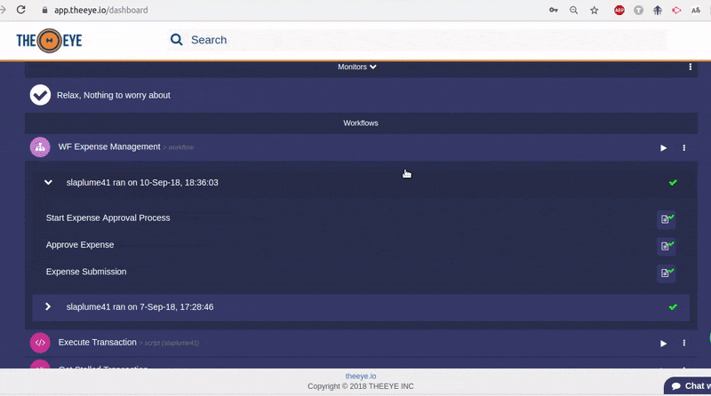
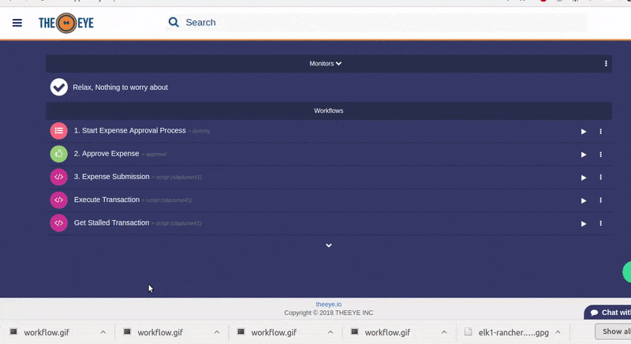
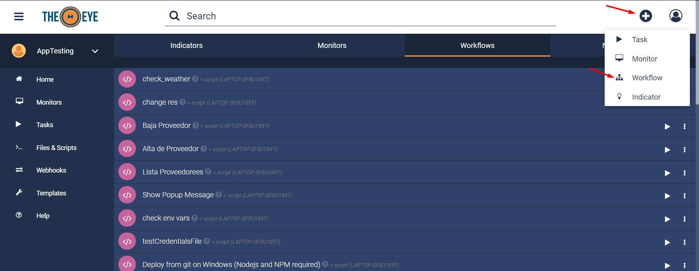
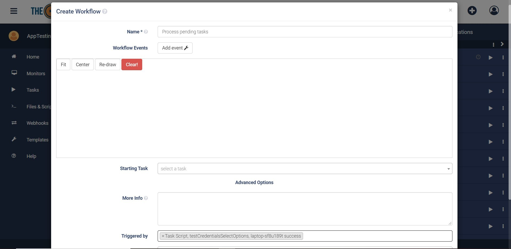
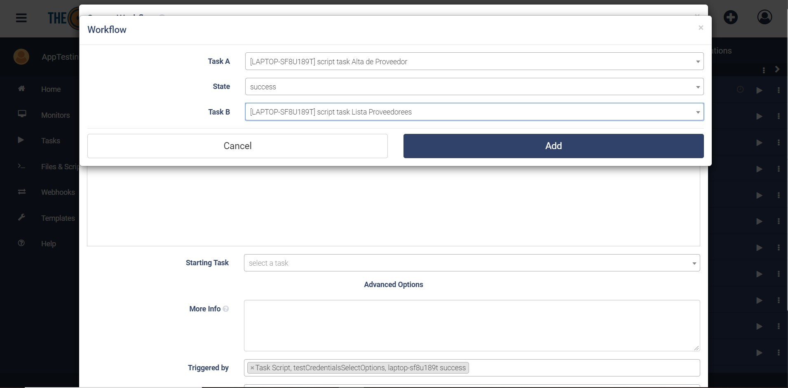
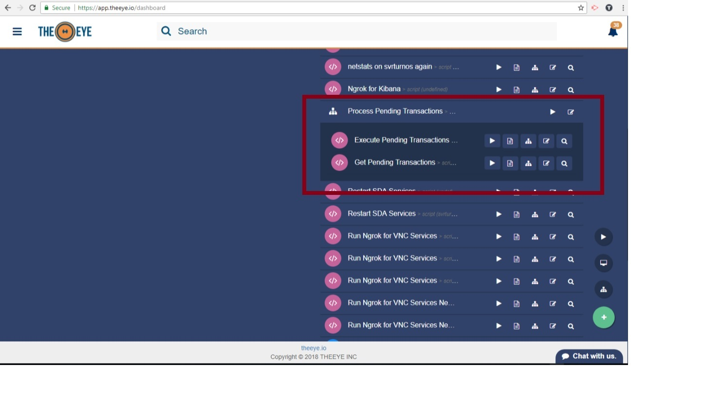

# Workflows

Los Workflows conectan varias tareas juntas para automatizar procesos complejos o dependientes entre sí. Puede ver sus Workflows en el dashboard junto con el resto de las tareas, y se distinguen por el ícono distintivo de Workflow

## Ejecutar Workflow

Los workflows se ejecutan de la misma manera que las tareas. Cada vez que se lanza un workflow, se crea un job, y la tarea seleccionada como tarea inicial va a ser ejecutada. En este ejemplo, se ejecutará la tarea _"Expense Management"_:

<!-- TODO: Poner una mejor imagen -->

## Crear un Workflow 

Como los Workflows conectan tareas entre sí, estas tareas deben ya estar creadas de antemano para poder usarse en workflows. Los argumentos se pasan de tarea en tarea por cada uno de los jobs del workflow. 

Aquí se muestra cómo se conectan 3 tareas para crear el Workflow _"Expense Management"_

1. Start Expense Approval Process (tarea de input)
   * Recibe inputs de tipo _text_, _file_ y _date_
2. Approve Expense (tarea de aprobación)
   * Espera inputs de tipo _text_, _file_ y _date_
   * Envía outputs de tipo _text_, _file_ y _date_
3. Expense submission (tarea de script)
   * Recibe inputs de tipo _text_, _file_ y _date_

<!-- TODO: Mejores imágenes -->

### Creación paso por paso

<!-- TODO: rehacer esta parte -->

Create a new workflow from the dashboard by clicking the "+" button:

Name your workflow and select a trigger \(Task or monitor\). In this example the trigger is a scrapper monitor that will report failure when the "transaction API" is down.

Add an event to connect tasks, by clicking "Add Event". The examples shows how the success event of task "Get Pending Transactions" will execute the task "Execute Pending Transactions" by passing all the pending transactions to it.

Workflow graph is drawn. Select your starting task and confirm to save the workflow.

Once the workflow is confirmed you'll see it in the dashboard as shown hereunder.

