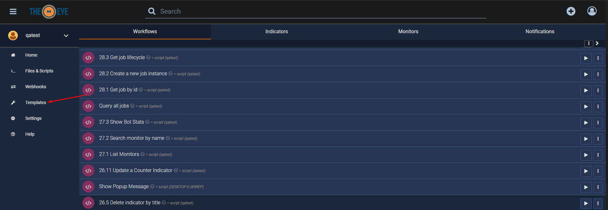
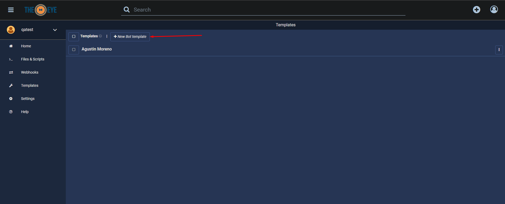
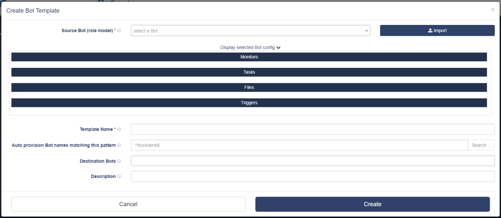

# Templates

When you automate with TheEye you create recipes that are executed by Bots. This recipes can be shared with other users or organizations by Templates.

 Go to the templates Menu in the left hamburguer menu:

### Create Template

Templates are based on Tasks and Monitors that run on Bots and are therefore applied to Bots. When creating a template you will need to identify the Bot you would like to start from \(the one that is asigned to the tasks and monitors you would like to reuse\). 

Click on "+ New Bot Template"

### Import a Template

Templates are imported from json files.

### Export a Template

Templates are Exported as json files.

Coming Soon

Worflows import/Export

