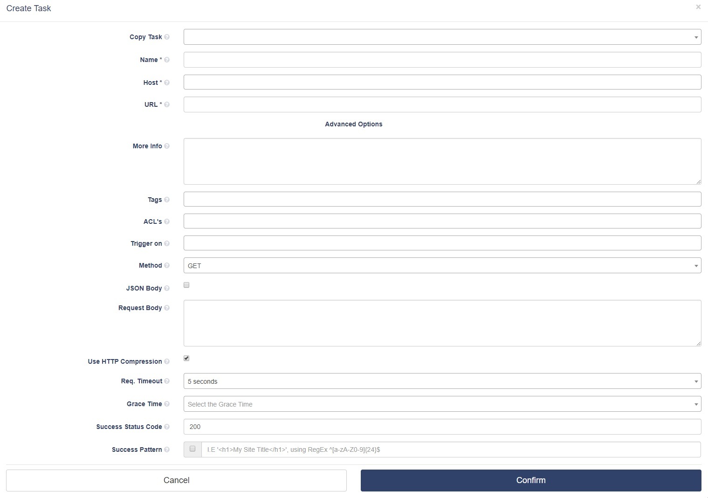

# Webhooks

## Working with Webhooks
A webhook in TheEye is a method of augmenting or altering the behavior of a workflow, or scripts, with custom callbacks. These callbacks may be maintained, modified, and managed by third-party users and developers who may not necessarily be affiliated with the originating website or application. 

### Incoming Webhooks
A webhook can be used to perform an action when an event occurs on other website. When that event occurs, the source site makes an HTTP request to the URL configured for the webhook.

Once it's created you can click on the icon on the left to copy the curl example.

To create a webhook \(incoming webhook\), just go to the _Webhooks_ section left menu, and click on "_+ new Incoming webhook_". Name it and save it. Once you have saved it, expand it, by clicking over the webhook box, you'll be able to see the URL assigned to the webhook.

The webhook you created can be used as a trigger for other resources \(e.g. You can set the webhook to be the trigger of a task\) as shown hereunder.

### Outgoing Webhook/HTTP Request Task

Select _Outgoing Webhook/HTTP Request_ on "+ create New Task" dialog to create tasks based on HTTP requests. 

The main difference between a _Script_ task relies on:

* **URL**: This is the endpoint URL for the request. If GET or POST method is used, the querystring must be provided \(E.g. [https://www.mysite.com?foo=foo&bar=bar](https://www.mysite.com?foo=foo&bar=bar)\)
* **Method**:  HTTP method \(GET, POST, PUT, DELETE, etc\)
* **JSON Body**: Only JSON data is accepted as a request body, if checked, the next _Request Body_ field will be used.
* **Request Body**: Provide the JSON data to be used as the request body.
* **Use HTTP Compression**: HTTP Compression flag.
* **Req. Timeout**:  The time to wait for response before considering the request has failed.
* **Success Status Code**: The HTTP code expected at response to consider it successful. Ref. [https://www.w3.org/Protocols/rfc2616/rfc2616-sec10.html](https://www.w3.org/Protocols/rfc2616/rfc2616-sec10.html)
* **Success Pattern**:  Expected HTTP body response. You can write plain HTML code or you can use a _Regular Expression_.

## Workflow

Workflow connects your tasks together to automate complex or dependent processes.

Which trigger would you like to use? You can start a workflow directly with a play button or you can use monitors or tasks as triggers.

Check the [Workflow Documentation](/core-concepts/tasks/tasks_workflows/) for more details.
