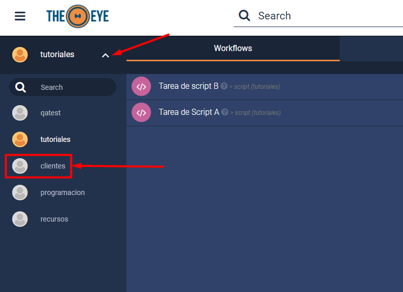
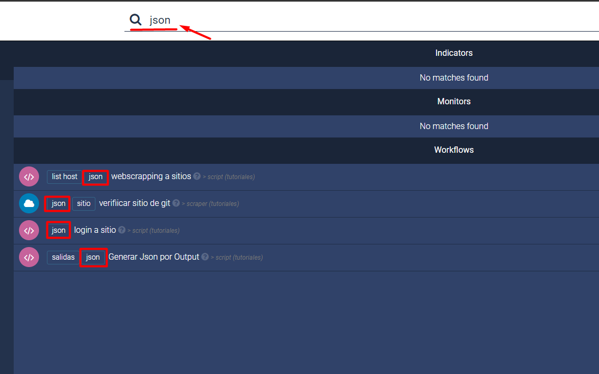
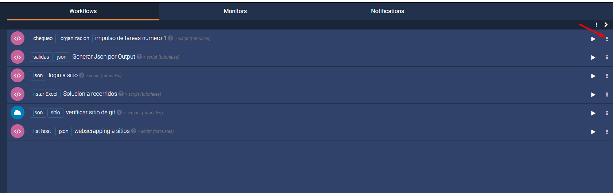
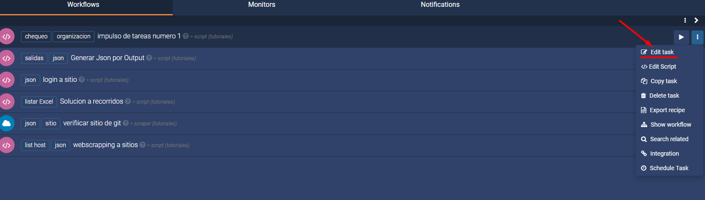
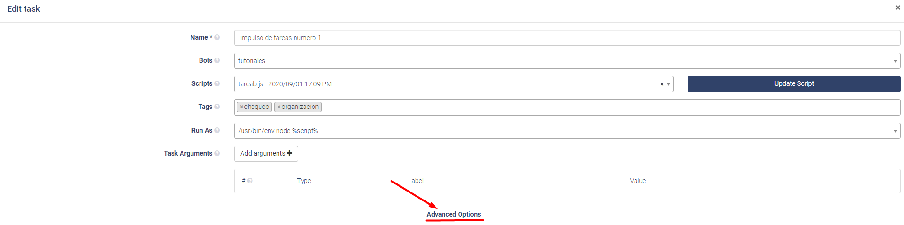
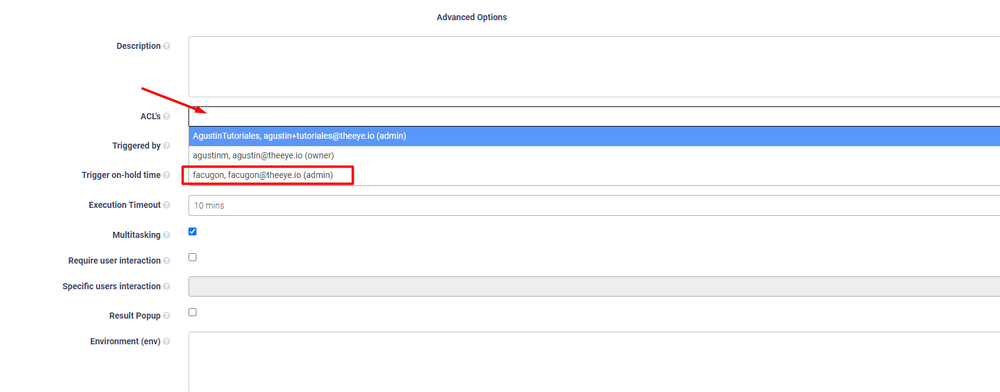
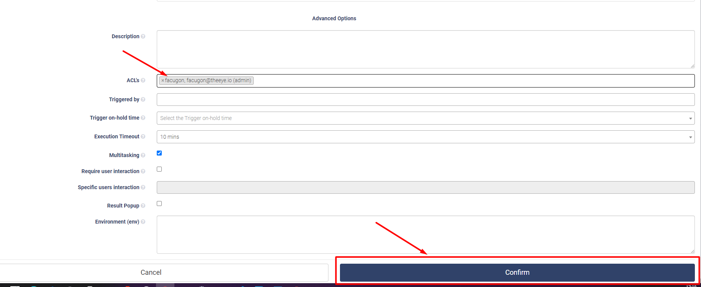
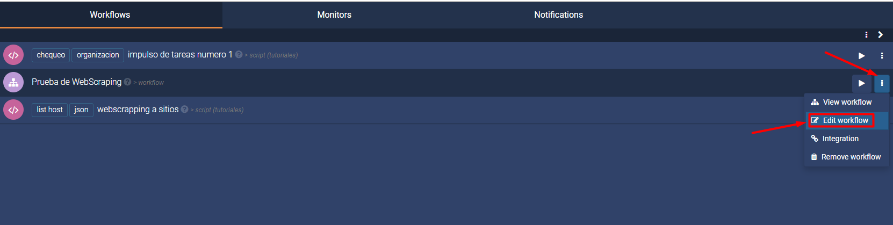
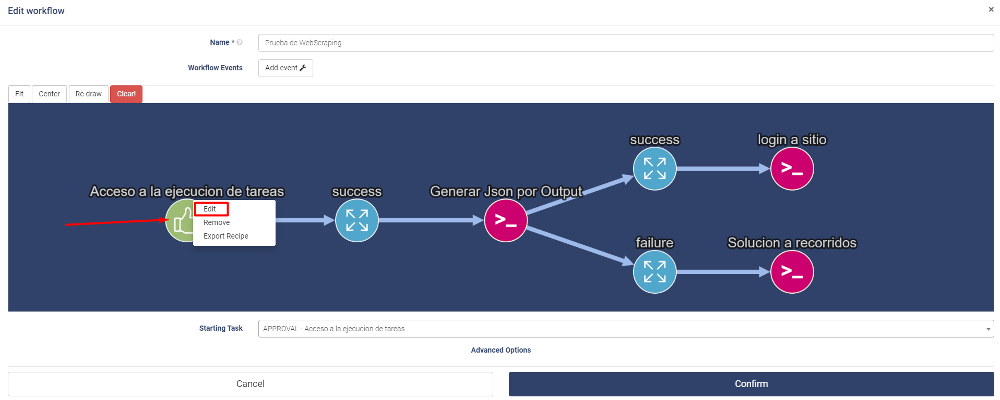
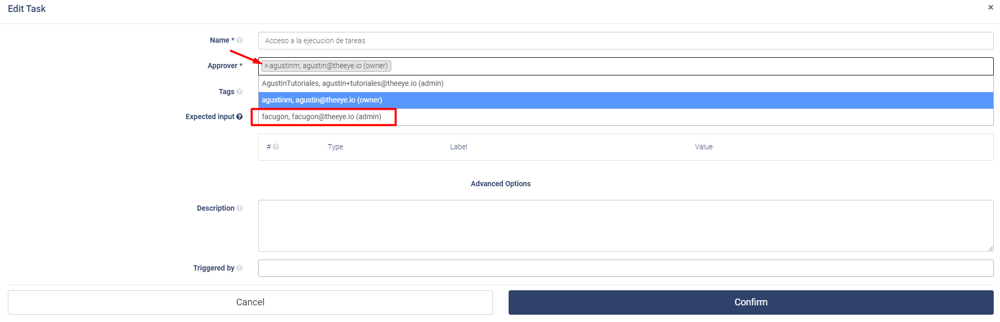

# IAM - Gestión de identidades
___

## Otorgar permisos de Aprobardor

### ¿Cómo accedo a la organización / unidad de negocio de una solicitud? 

Hacer Click en el menú de organizaciones y seleccionar la Unidad de Negocio para la cual solicitan el recurso:

___

## Identificación de Tareas

### ¿Cómo identificar las tareas por sus Tags?

___

## Gestión de Accesos (ACL)

### Como darle a un usuario acceso a una tarea desde ACL

1) Hacemos click en los tres punts que nos indica la flecha

2) Vamos **Edit task**

3) Click en el titulo de **Advanced Options**

4) Vamos al campo de **ACL** y nos mostrara los usuarios que estaran en la organizacion y lo seleccionamos clickeando en el mismo.

5) Cuando lo hayamos seleccionado hacemos click en **Confirm** y el usuario ya estara asignada a esa tarea.

___

## Modificar el Autorizador de una tarea de Aprobación

El autorizador deberá cumplir con los siguientes requisitos:

* Usuario de TheEye

* Pertenecer a la organización solicitada dentro de TheEye

Primero se debe identificar la tarea.
Si la tarea pertenece a una Workflow se debe solicitar el nombre del Workflow.

Para cambiar el autorizador, se debe editar la tarea.

1) Editamos el workflow haciendoclick en los 3 puntos y luego **Edit Workflow**

2) Click en el icono de Approval y elegimos la opcion de **Edit**

3) En el campo **Approver** hacemos click y seleccionamos al usuario.

