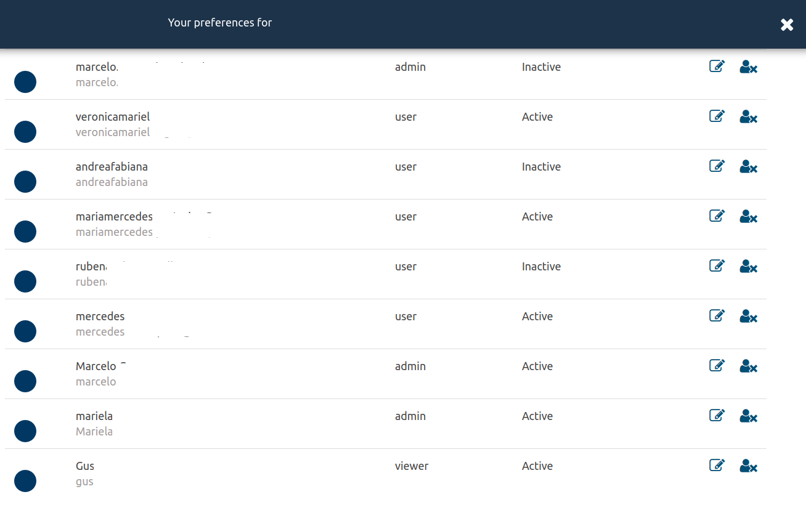

# IAM - Roles and access management

-----

## Roles by group

   | Role        | Task     | IAM      | CRUD     | ACL's    | 
   | -----       | -----    | -----    | -----    | -----    | 
   | Onwer       | &#10003; | &#10003; | &#10003; | &#10003; | 
   | Admin       | &#10003; | -        | -        | &#10003; | 
   | Manager     | view     | &#10003; | -        | -        | 
   | User        | execute  | -        | -        | -        | 
   | Viewer      | view     | -        | -        | -        | 
   | Agent       | \*       | -        | -        | -        | 
   | Integration | \*       | -        | -        | -        | 

### Human Users

1. **owner**

    * full access
    * full control of organizations
    * create and modify
    * tasks execution
    * acls administration
    * members control

2. **admin**

    * full access
    * create and modify
    * tasks execution
    * acls administration

3. **manager**

    * members control
    * view (ACL's required)
    * tasks execution (ACL's required)
      
4. **user**

    * view (ACL's required)
    * tasks execution (ACL's required)

5. **viewer**

    * view (ACL's required)

-----

### Bot Users

1. **agent**

2. **integration**

## Members control

To add, modify or revoke users for the current organization, go to the left hamburguer menu , then go to _Settings_ > _Members_ section.

When you invite a new member, it will be prompted to select the user's role \(admin/user/viewer/manager\).
The role can be changed at any time by a manager or the owner of the account.

-----

## ACLs

In the previous section we've described user roles and user administration.
ACLs applies directly to resources.
Admin users can make resources visible to other members by adding them to the input field labeled _ACL's_ available on _Tasks_ and _Monitors_.
When a user is added to an ACL list, then the resource becomes available and accesible according to the member's role.
Notifications are sent to all users within the ACL list, regardless the user role.

-----

## Users Domain Controller

On-premises installation allows to integrate the core users authorization and access control to a Domain Controller.

### Setup

TheEye creates a copy of the user Domain Controller profile with the following attributes:

* id

* fullname

* email

* username

* groups

The groups are required to assign a credencial in TheEye, acl y and permissions.

With the created profile, the user will be identifid in the logs activity and in the user interface.

Some common **pre-requistes** to integrate Domain Controller AD or LDAP

* Bind DN

* Bind Credentials

* TLS Certificate

Once the integration is configured, the system will authenticate every user authentication request by default throught the Domain Controller.

### Groups

To allow a user to use theeye it must be assigned to the group **theeye_users**

User profile can be controlled via Domain, assigning the user to one of the following groups

  * theeye_owners     

  * theeye_admins     

  * theeye_managers    

  * theeye_users   

  * theeye_viewers

Then, follow hereunder steps to allow a domain user to access TheEye:

#### Step 1

In the Domain Controller add the group to the desired user.

If the user is assigned to an invalid group, the login attempt will be rejected.

#### Step 2

Login the web interface using a user with credential owner or manager.

Invite the user from the members panel of the organization.

#### Step 3

The user is ready to login TheEye

