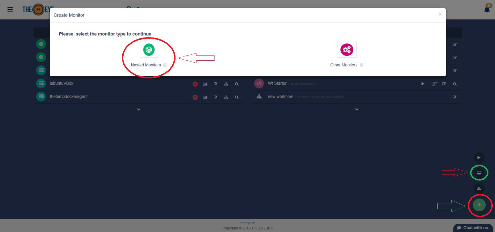
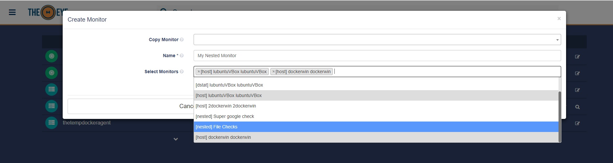

# Monitors

## Monitor type: 

### Stats

Checks your Hosts' stats \(health\) and triggers alerts when thresholds are exceeded. You can set your own thresholds from the monitors panel.

### Script

Create a script and use the output log to monitor a state when other monitor does not suit your needs. This is an example script to check if a bridge is running.

### API/WEB check

Sends a request to and endpoint and checks for an expected answer. Custom payload and custom expected responses are allowed.

### Process

Verifies that a process is running \(e.g. daemon\)

### File

A File monitor will upload a file to a server and ensure that the file remains as created in the destination path you provided. Most common use is to push a configuration file. The file can be updated at any time directly from the monitor box.

### Nested

A nested monitor is a special monitor that contains other monitors. This kind of monitor will notify when all the contained monitors needs attention. You can create a nested monitor from the dashboard, using the "+" button.

Name your "nested Monitor" or copy an already created one. Add or remove the monitor you'd like to nest.

## List monitors via API

Check the [API Documentation](/en/integrations/api/list_monitors_via_api) for more details.
