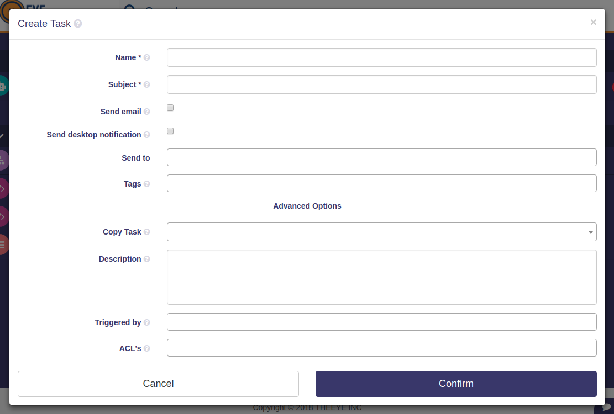
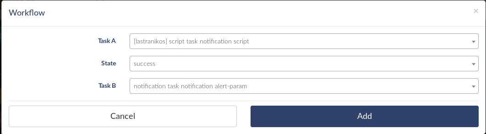

# Notification Task

[](https://theeye.io/en/index.html)

## How to work with tasks and notifications.

The toolkit allows you to streamline the flow of notifications and trigger them.

The notifications can have different origins:

- A script task, you can send your output parameters as input for a notification task.

- An input task, allows an operator to load the parameters of the msg that will receive the notification task.

- A notification can be part of a workflow.


*If you need assistance, contact us*


### Notification Task details.




*This type of tasks are responsible for sending messages inside and outside theeye*

| UI Property | API Property | Type        | Description |
| ---         | ---          | ---         | --- |
| Name        | name         | text        | an identification name for the task |
| Subject     | subject      | text        | subject to include in all the of notifications |
| Send Email notification | notificationTypes.email | boolean | whether or not to send notification via email |
| Send Desktop notification (theeye desktop app) | notificationTypes.desktop | boolean | whether or not to create an internal notification to theeye app desktop and mobile. If checked (true), this will create a new Notification in the App Notifications panel |
| Send To     | recipients   | text array  | the list of recipients. should be valid user emails and must be registered in theeeye |
| Tags        | tags         | text array  | list of tags. this is usefull to filte and search in theeye app |
| Description | description  | text        | a description. this is added in workflows documentation and in the app ui |
| Triggers    | triggers     | Event array | chain tasks events to create workflows |
| ACL's       | acl          | text array  |  | 
| Email Body  | body         | text, html formatted allowed | this field is used if the *send email* is checked (true). else is ignored and won't be visible in the task form |
| Send Push notification (mobile) | notificationTypes.push | boolean | whether or not to send mobile notification |


### Basic Usage

[Click to download a sample Notification Task recipe to import into your workflow](../../assets/recipes/task_type-notification-send_notification.json)

### Triggered by events
The notification task can be triggered by other task or monitor as shown below:

#### Triggered by _Input_ task

The input task is responsible for getting the data that will be delivered to the notification task.

Check the [Task input](/en/core-concepts/tasks/) for more details.

[Click to download the sample Input Task recipe to send notification](../../assets/recipes/task_type-input-send_notification.json)

#### Triggered by _Script_ task or monitor

This task is responsible for executing the code that generates the output required as input parameters for the notification task.

Check the [Task scripts](/en/core-concepts/tasks/) for more details.


#### Notification task's arguments

In order to work with dynamic arguments for a notification task, the script task must generate the output with the following format.

```json
["subject","the email body raw text or html","info@theeye.io"]
```

The 3 arguments are required. If you need to ignore one argument or prioritize the once set in the task definition, use an empty string ""

In this example, the third argument is ignored and the recipients from the task definition will be used.

```json
["subject","the email body raw text or html",""]
```


| Name | Format | Description |
| ---- | ---- | ---- |
| subject | plain text | this is the subject for all notifications configured to send in the task definition |
| body | plain text/html | this is the email body |
| recipients | text/json array | the destination user emails registered in theeye. could be a single email or an array of multiples emails |


[Click to download the sample Script Task to send notifications](../../assets/recipes/task_type-script-send_notification.json)

### Sample tasks for sending notifications

**Create a workflow**

- task A: notification script
    - [Task type: Scripts](../../assets/recipes/task_type-script-send_notification.json)
- state: success
- Task B: task notification
    - [Task type: notification](../../assets/recipes/task_type-notification-send_notification.json)




**Run a workflow**


