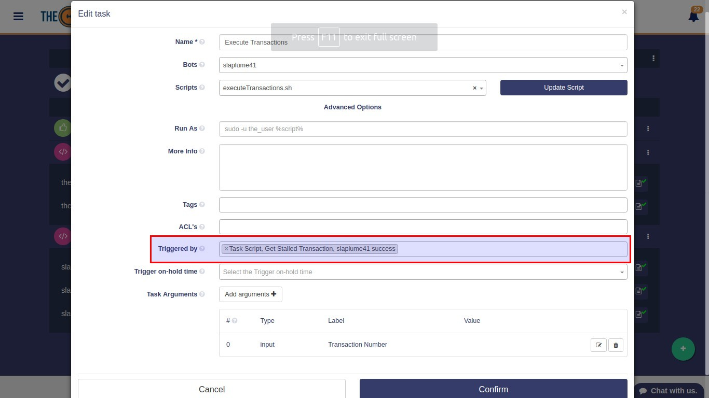

# Task Triggers

You can launch tasks in different ways. On one hand you can start them directly using the play button, on the other hand you can use triggers. Tasks are also started by Workflows.

### Tasks triggered by other tasks

When Tasks are triggered by other tasks, the output of the triggering task can be used as input as well. The key is to match trigger output with triggered input.

In this example we use the _success_ event of the Task "Get Stalled Transaction" to trigger "Execute Transaction". The transaction number is passed over tasks.

Task "Execute Transaction" expects a transaction number and is **triggered by** "Get Stalled Transaction". The task configuration is shown below.

When "Get Stalled Transaction" tasks finishes running **successfuly**, then "Execute Transaction" is launched. The output data from "Get Stalled Transaction" is then used as input.

To use this feature, begin writing your script from the provided example that can be retrieved using  the "Load Example" button available at script creation time.

### Tasks triggered by Monitors

Monitors can be used as triggers in the same way tasks do. Just set the monitor event you like as the "triggered by" field in the task.

If the output from the monitor is needed by the launched task, you will need to use the scripts as shown in the examples. You will always be able to load an example at creation or edition time.

### Tasks triggered by Workflows

Workflows triggers the task that is set as Starting Task, as shown below.

 

