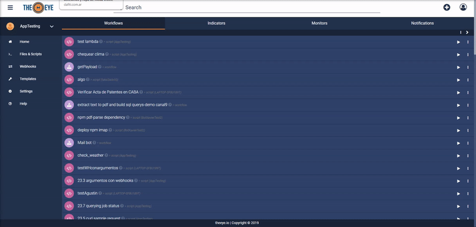
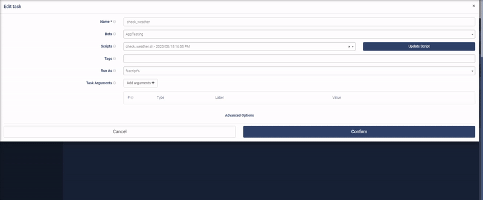
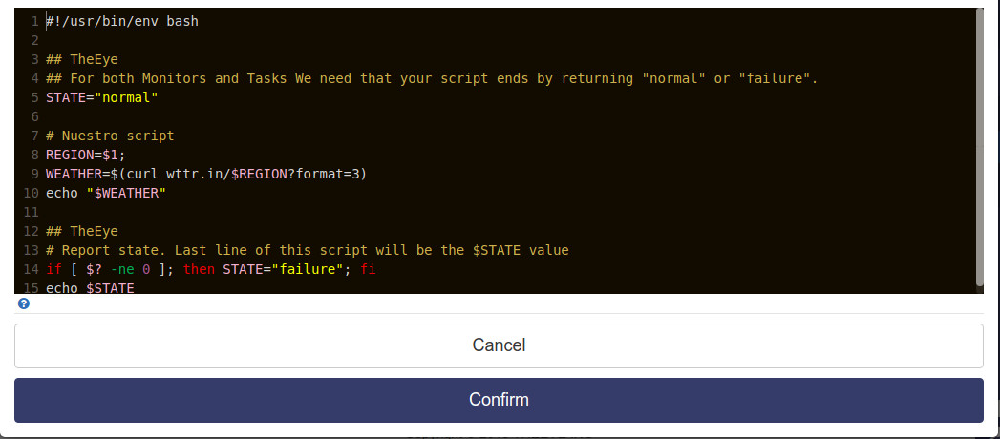
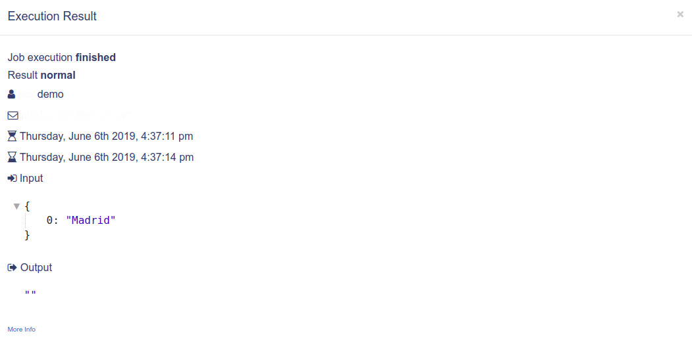
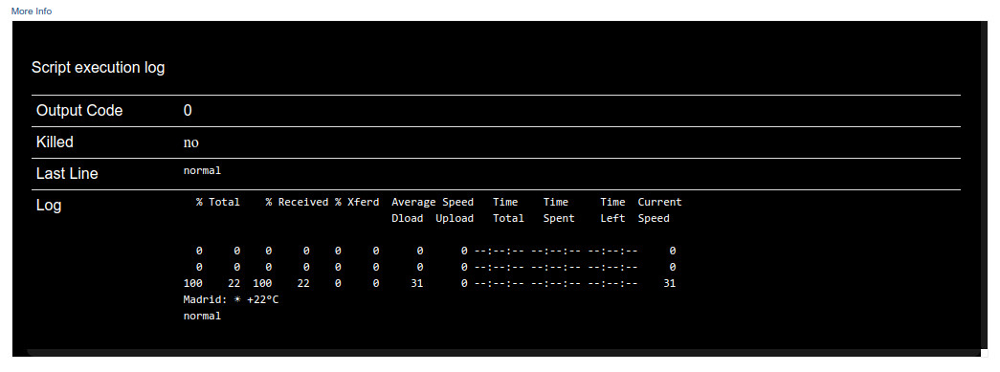
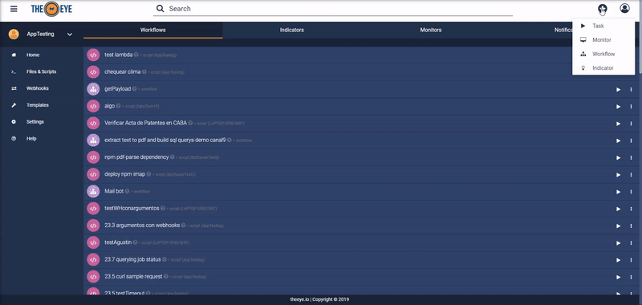
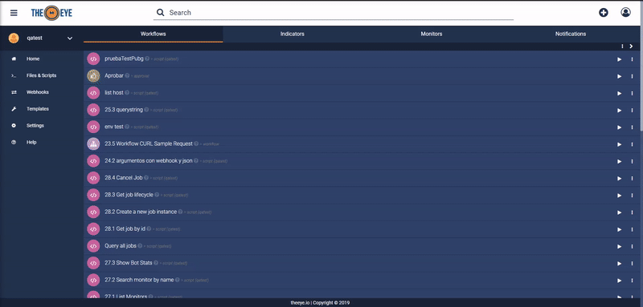

# First Steps to start using TheEye:

[](https://theeye.io/en/index.html)

##  You will need a User account and organization
1. If you have an user account, enter in [https://app.theeye.io/login](https://app.theeye.io/login)
2. If you do not have a user account, enter here [https://app.theeye.io/register](https://app.theeye.io/register) and register one.
      1. After registering your account we send you a confirmation email.
      2. Activate your account and start automating with TheEye. 
         1. Register your account username.
         2. Register the name of your organization.

An **organization** in TheEye is an entity that comprises multiple objects, such as multiple hosts or a sequence of automated tasks and triggers, that has a particular purpose.

Once you've activated your user account, you'll see this Dashboard after login:


## Build your playground
The Tutorial will guide you through the installation process of a **Bots** and will show you how to create a **task**.

### I came for the **bots**!
In TheEye you would like to perform actions or automate with **bots**

Start the self-provided Bot or Install one on each server.

#### Just give me a bot!
For launch the self provided Bot, and begin automating processes. Go to
the web panel ([settings -> installer](https://app.theeye.io/dashboard#installer))


#### Install your own bot, and then a hive!!

**\(You can skip this section if you're using the self-provided Bot\)**

If it is the first time you access TheEye Website, from the web panel ([settings -> installer](https://app.theeye.io/dashboard#installer)) you can download the binary agent and get the installation script for your host.




For more information please check the installation documentation in ([Bot Installer](/en/core-concepts/agent/)) you can download the binary agent and get the installation script for your host.

### Play with bots

Let's do a small task just to play a little.

We're going to have our bot report information to us. For this we will send information with a parameter, and the bot will make a query to a webservice to get the rest.

** As a prerequisite you need a bots, so if you do not have one, install one following the steps above. **

For this task we will follow the following steps from the dashboard:

#### We create the resources
- We create a task and the script associated with it
    - Name: check_weather
    - Bots: bots
    - We create the argument
        - type: Fixed Value
        - value: Madrid
            - This should be the name of the city on which we are going to check the weather.



- Now we select to create scripts
    - File name: check_weather.sh
    - Copy the following code into the script editing window and save the changes.

```
#!/usr/bin/env bash

## TheEye
## For both Monitors and Tasks We need that your script ends by returning "normal" or "failure". 
STATE="normal"

# Our script
REGION=$1;
WEATHER=$(curl -sS wttr.in/$REGION?format=3)
echo "$WEATHER"

## TheEye
# Report state. Last line of this script will be the $STATE value
if [ $? -ne 0 ]; then STATE="failure"; fi

echo { \"state\":\"$STATE\", \"data\":{ \"data1\":$WEATHER}  }
```



#### Let them run!

Now in the Dashboard we will see our resources. We should have something like this:


If this is the case, let's play the "check_weather" script inside the workflow.

Then we will be able to see the results report of the task.



In this report we can see the STATE result as well as the parameters sent.

We will be able to have an extended repote by clicking on "More info"



We hope this document has been helpful. You can find more information in the documentation system. In case you need assistance, contact our support team.

Check the [Support team information](/en/support/) for more details.

## Understanding the parts
### Dashboard: Check your first resource

Check the Dashboard view after login, you should see "All up and running" in the monitors panel.

### Users

TheEye provides six different user roles. You can create users on the go with the appropiate role. See the [Users Management Documentation](/en/user-management/) for more details.

### Resources

TheEye provides a way to store technical knowledge in Resources that become usable in many different aspects. Each resource is explained hereunder.

#### Monitors

A monitor is used to check services' or resources' status. You can use this status information to take actions \(e.g. run a task, send notification\). You can always customize the time between checks.

There are five kind of monitors you can set up from TheEye: Stats, Script, API/Web Check, Process and File. Check the [Monitors Documentation](/en/core-concepts/monitors/) for more details.

* Monitors will notify for events as desired. Check the Users ACLs' section for [Notifications](/en/core-concepts/alerts-and-notifications)

#### Tasks

A task is an action that can be performed or executed on demand. You can also use the task scheduler to create and manage tasks that TheEye will carry out automatically at the times you specify. Check the [Tasks Documentation](/en/core-concepts/tasks/) for more details.



#### Scripts

You can write scripts directly from TheEye web to your servers or you can create scripts to be used as API Calls or monitors. 

Check our [TheEye-io gist](https://gist.github.com/theeye-io) scripts page.

#### Templates \(Provisioning\)

One of the main advantages brought by TheEye is the fact that all your technical stuff is stashed at the moment it is created \(scripts, tasks, monitors\). Provisioning allows you to reuse your stuff for other servers in the same way a template works. To reuse all the resources created for a server, go to _Templates_ in the left menu, select your source host in the _base template_ input box, set a name for the template and select your destination hosts in the _Hosts to add to the template_ input box. All the resources from your source host will now be available on your destination hosts. Templates can be exported to be used on other organizations, in the same way they can be imported. Check the Templates Documentation for more details.



#### Webhooks

A webhook can be used to perform an action when an event occurs on other website. When that event occurs, the source site makes an HTTP request to the URL configured for the webhook.

To create a webhook \(incoming webhook\), just go to the _Webhooks_ section left menu, and click on "_+ new Incoming webhook_". Name it and save it. Once you have saved it, expand it, by clicking over the webhook box, you'll be able to see the URL assigned to the webhook.


The webhook you created can be used as a trigger for other resources \(e.g. You can set the webhook to be the trigger of a task\) as shown hereunder.


#### Workflow

Workflow connects your tasks together to automate complex or dependent processes.

Which trigger would you like to use? You can start a workflow directly with a play button or you can use monitors or tasks as triggers.

Check the [Workflow Documentation](/en/core-concepts/tasks/tasks_workflows/) for more details.

