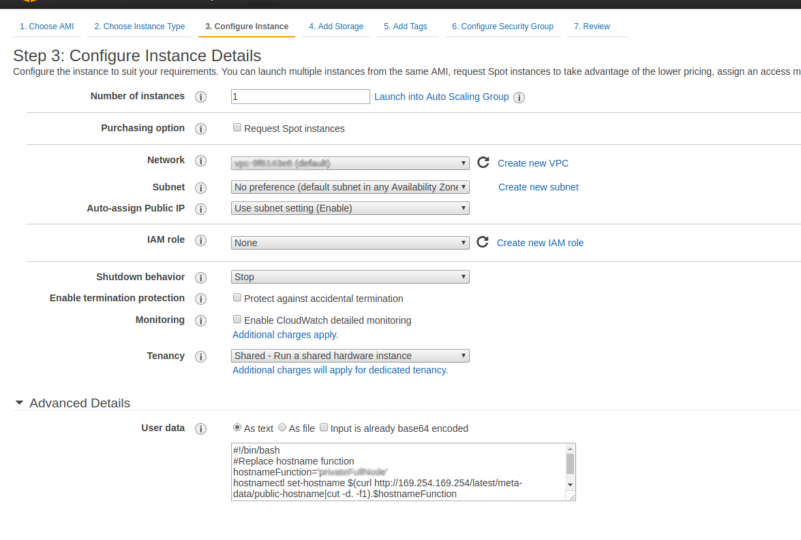

# Theeye Integrations

[](https://theeye.io/en/index.html)


## AWS EC2

If you plan to launch a EC2 Instance, you can automatically set a suitable hostname and install theeye agent.

Steps:

  * 1- go to your profile and copy theeye installation script: https://theeye.io/profile


  * 2- launch a new EC2 instance, hold on step number 3, you will fullfill advanced settings with the following script (watch out to full fille both hostnameFunction and theeyeInstall variables to fit your settings)

```
#!/bin/bash
#Replace hostname function
hostnameFunction='YourHostname'

#Replace theeyeInstall with the contents of step number 1.
theeyeInstall='curl -s "https://s3.amazonaws.com/theeye.agent/linux/setup.sh" | bash -s "yourID" "yourSecret" "YourOrganization"'

hostnamectl set-hostname $(curl http://169.254.169.254/latest/meta-data/public-hostname|cut -d. -f1).$hostnameFunction
$theeyeInstall
service theeye-agent restart
```



