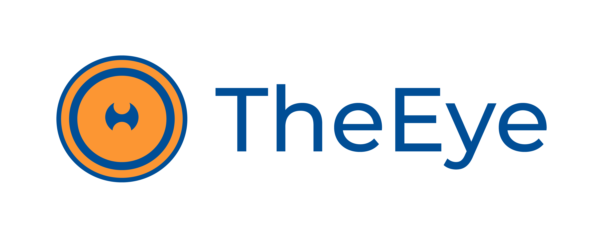

# Introducción a TheEye

## ¿Qué es TheEye?

*Un orquestador.*

**TheEye** es una *plataforma de automatización* centralizada que permite *orquestar procesos* mediante una interfaz WEB y la API Rest. La plataforma recibe llamadas de bots y conexiones de clientes e internamente mantiene estados para realizar el seguimiento de estos, de los monitores e indicadores, los resultados de la ejecución de las tareas y flujos de trabajo, el registro de los eventos, envío de notificaciones; ayudando además a mantener scripts y archivos involucrados en los procesos y automatizaciones. 

Debido a su versatilidad, se puede utilizar de diversas formas. Entre ellas 

* Contar con una herramienta de monitoreo y administración de los recursos. 
* Despliegue de entornos tanto de desarrollo como producción. 
* Administrar y planificar tareas. 
* Crear workflow de trabajo mediante el resultado de tareas.
* Repositorio de conocimiento técnico.
* Plataforma de Integración de sistemas modernos y legacy.
* Acelera el desarrollo de backoffice.
* Centralización y mantenimiento de script.
* Herramienta de soporte en tiempo real.
* Dar autonomía a desarrolladores y a usuarios finales

## Vocabulario del Dominio

- [Client Connections](#client-Connections)
- [Authorization System](#authorization-System)
- [Host & Agent](#host-amp-agent)
- [Monitor](#monitor)
- [Task](#task)
- [Workflow](#workflow)
- [Indicator](#wndicator)
- [File & Script](#file-amp-script)
- [Webhook (Incoming / Outgoing)](#webhook-incoming-outgoing)
- [Bot](#bot)

### Client Connections

Todas las conexiones desde interfaces externas, robots, APIs, Webhook, Sockets, entre otros son consideradas **clientes**. Todos los clientes tienen la capacidad de conectarse con la plataforma a través de protocolos de comunicación seguros utilizando diferentes métodos de autenticación y conexión. TheEye proporciona una interfaz de usuario web para el cliente principal que cuenta con las principales operaciones, y además se pueden implementar mecanismos alternativos para interactuar con las APIs mediante usuarios autorizados.

### Authorization System

**User, Customer, Member, Credential**

Un **User** representa cualquier identificación válida y registrada en la plataforma. Los usuarios pueden ser 

- User
- UiUser
- BotUser

Una vez activados, los usuarios son responsables de la seguridad y solidez de sus credenciales de acceso.

**Customer** corresponde a las organizaciones dentro de la plataforma. Las organizaciones son una forma de agrupar los recursos generados y los usuarios que los usan y administran.

**Member** es la asociación de una usuario con una organización. Un usuario puede pertenecer a una o muchas organizaciones. A su vez los usuarios cuentan con credenciales que les otorgan visibilidad y acceso a diferentes recursos dentro de las organizaciones.

**Credential** es el rol que cumple un usuario dentro de cada organización. Actualmente los roles disponibles son 

- Viewer
- User
- Manager
- Admin
- Owner

Existe una credencial **root** que otorga permisos especiales sobre la plataforma. Estos permisos permiten acceder a la base de usuarios y organizaciones, para administrar los accesos y la configuraciones generales del sistema. 

### Host & Agent

**Agent** es una pieza de software desarrollada exclusivamente para conectarse con la API de TheEye y realizar las siguientes acciones

- Ejecución de Tareas (Task Runner)
- Monitor de Recursos (Monitoring)

**Host** es cualquier instancia, servidor o máquina que pueda ser utilizada para desplegar las automatizaciones y recursos desarrollados sobre TheEye. Cualquier **Host** que este correctamente configurado y que permita la instalación del **Agent** tendrá compatibilidad inmediata con TheEye. Es importante que el **Host** cuente con acceso a Internet. Existen diferentes alternativas para utilizar TheEye de forma totalmente local u on-premises.

### Monitor

**Monitor** permiten verificar y garantizar el correcto funcionamiento de los recursos utilizados para las automatizaciones. A partir de los cambios de estado de los monitores TheEye emite eventos que pueden ser utilizados para automatizar acciones y emitir notificaciones. Los monitores son ejecutados por los **Agent**.

Hay 5 tipos de monitores disponibles 

- Health (dstat)
- Script (script)
- API / Web Check (scraper)
- Process (process) 
- File. (file)

### Task

**Task** es la forma de registrar y configurar el comportamiento y las acciones que se van a realizar a través de TheEye. Las tareas deben ser consideradas como plantillas que se pueden ejecutar bajo demanda, pueden ser modificadas, copiadas, se les puede hacer backup y pueden exportar e importadas a otros entornos. Las tareas registradas en la plataforma se pueden ejecutar manualmente desde la Interfaz Web, invocarlas vía Api, pueden ser configuradas para que se ejecuten de forma automática vía Triggers o de manera periódica utilizando el **Scheduler**. 

### Workflow

### Indicator

### File & Script

### Webhook (Incoming / Outgoing)

### Bot

## Internal Micro-Services

- [Event Dispatcher](#Event-Dispatcher)
- [Job Dispatcher](#Job-Dispatcher)
- [Job Scheduler](#Job-Scheduler)
- [Notification System](#Notification-System)
- [Authentication System](#Authentication-System)

### Event Dispatcher

### Job Dispatcher

### Job Scheduler

### Notification System

### Authentication System
