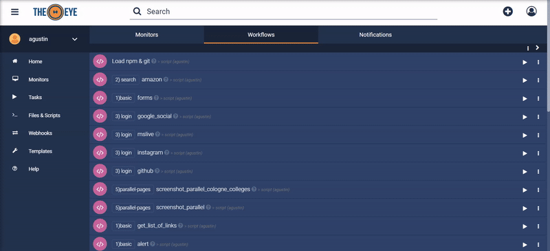

# Tasks

Las tareas (tasks) son la forma de registrar y configurar el comportamiento y las acciones que se van a realizar a través de TheEye. Las tareas deben ser consideradas como plantillas que se pueden ejecutar bajo demanda, pueden ser modificadas, copiadas, se les puede hacer backup y pueden exportar e importadas a otros entornos. Las tareas registradas en la plataforma se pueden ejecutar manualmente desde la Interfaz Web, [invocarlas vía API](/es/api/), pueden ser configuradas para que se ejecuten de forma automática vía [Triggers](./triggers.md) o de manera periódica utilizando el [Scheduler](#Task-Scheduler).

## Crear y modificar tareas

Crear una tarea es simple. Desde el dashboard, cliquea el boton **+** y en el menú selecciona la opcion _Task_. Eso abrirá un menú en el que puedes seleccionar el tipo de tarea que quieres crear

## Tipos de Task

### Script

Las tareas de Script requieren un Bot para ejecutarlas. Estas tareas ejecutan un script asociado a la misma.

Revisa la documentación de [tareas de Script](./script_type.md) para más información.

### Webhooks o Request HTTP

Un Webhook en TheEye es un método de alterar o aumentar el comportamiento de los Workflows o Scripts, usando callbacks externos que pueden estar mantenidos y administrados por usuarios de terceros o developers que pueden no estar afiliados con los desarrolladores originales de la aplicación o página web

Revisa la documentación de [Webhooks](../webhooks/) para más detalles.

### Approval:

Las tareas de aprobación (Approval tasks) están pensadas para usar en [Workflows](./workflows/). Una tarea de aprobación va pausar la ejecución del Workflow hasta que sea aprobada o rechazada. Pueden elegirse muchos usuarios para actuar de aprobadores, con que solo uno de ellos apruebe la tarea, el workflow continuará su curso.

### Input:

Una tarea de input es una tarea especial, usada comúnmente al inicio de workflows. Cuando se ejecuta, los parámetros solicitados pasarán directo a la siguiente tarea del Workflow.

### Notificación:

Como su nombre lo indica, la tarea de notificación envía notificaciones a los usuarios seleccionados, sea mediante la interfaz o por email. Revisa la [documentación de tareas de notificación](./taskNotifications) para más detalles.

## Task Arguments

Para recibir valores de input para tareas, es necesario definir sus argumentos.
Es importante tener en cuenta que los argumentos deberían ser definidos en el mismo orden que se usan dentro de la tarea.

| Tipo de argumento     | Nombre en la UI | Uso en la UI                                                                                                                                                                                                                                                                  | Uso en Workflows                                                                      |
| --------------------- | --------------- | ----------------------------------------------------------------------------------------------------------------------------------------------------------------------------------------------------------------------------------------------------------------------------- | ------------------------------------------------------------------------------------- |
| Fijo                  | Fixed           | No será visible en el formulario                                                                                                                                                                                                                                              | Es una variable fija definida en la tarea, no se puede modificar                      |
| Texto                 | Text            | Una input de texto simple                                                                                                                                                                                                                                                     | Útil para recibir valores dinámicos                                                   |
| Objeto en JSON        | JSON            | Una input que recibe solo strings de JSON                                                                                                                                                                                                                                     | Útil para validar la variable como JSON válido antes de ejecutar                      |
| Selección de opciones | Options         | Te ofrece varias opciones predefinidas para que elijas antes de ejecutar                                                                                                                                                                                                      | Se comporta como un argumento de texto                                                |
| Opciones remotas      | Remote options  | Crea un argumento de opciones usando la respuesta de una API. Se puede incluir el mail del usuario ejecutando la task usando la keyword `%THEEYE_USER_EMAIL%` en la queystring del url de la API, por ejemplo: http://tracking-tool.domain.com/tickets?user=%THEEYE_USER_EMAIL% | Se comporta como un argumento de texto                                                |
| Fecha                 | Date            | Crea un selector de fecha y toma su input                                                                                                                                                                                                                                     | Se comporta como un argumento de texto                                                |
| Email                 | Email           | Un input de texto que solo recibe direcciones válidas de email                                                                                                                                                                                                                | Se comporta como un argumento de texto                                                |
| Expresión regular     | RegExp          | Un input de texto que solo recibe expresiones regulares válidas                                                                                                                                                                                                               | Se comporta como un argumento de texto                                                |
| Archivo               | File            | Crea un botón para subir un archivo                                                                                                                                                                                                                                           | En una tarea de script, el archivo se sube al agente y se le pasa el path al archivo. |

## Task Scheduler.

Se puede usar el Task Scheduler para administrar tareas que se ejecutarán en horarios programados, dichos horarios se pueden definir usando lenguaje natural (en inglés) o expresiones CRON. Las expresiones CRON son más precisas, pero suelen ser menos intuitivas de programar.

Se pueden programar Schedules desde la página principal, como se muestra en la imagen

## Exportar e Importar tareas

Es posible que desee hacer una tarea que alguien de la comunidad TheEye ya haya hecho, por lo que poder compartir tareas es una funcionalidad crucial en el ecosistema TheEye.

Al exportar una tarea, se puede hacer mediante un backup, el cual contendrá información sensible y potencialmente secreta, o mediante una receta (*recipe*), la cual está pensada para compartir con la comunidad, y se omite información sensible como el contenido de los argumentos fijos.

Para exportar una tarea, ubíquela en la págiina principal, abra su menú de opciones, y cliquee el botón *"export recipe"*, como se muestra en la imagen

 
<!-- TODO: Actualizar imagen -->

Para importar una tarea desde su receta o su backup, puede dirigirse al menú de creación de tarea, y cliquear el botón *"Import"*

## Disparar tareas desde la API

Es posible disparar la ejecución de tareas desde la API. Revisa la [documentación de la integración desde la API](/api/) para más detalles.

<!-- TODO: Documentar la API -->

## Ejecutar tareas

Las tareas se pueden ejecutar de varias maneras:

* Manualmente desde la app
* Desde la API
* [Workflows](./workflows)
* [Triggers](./triggers)
* [Webhooks](./../webhooks)
