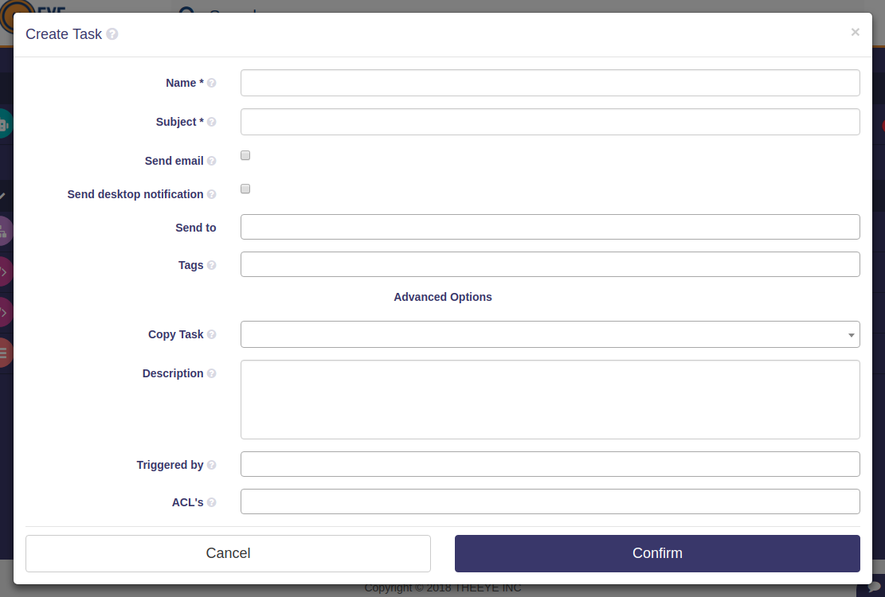

# Tareas de notificación

[](https://theeye.io/en/index.html)

## Cómo trabajar con notificaciones

Una tarea de notificación puede ayudarte a facilitar el proceso de notificar a los usuarios acerca de otras tareas

Las notificaciones pueden tener diversos orígenes:

- Una tarea de script, que envía sus parámetros de output a la tarea de notificación
- Una tarea de input, para notificar a los usuarios sobre los parámetros introducidos
- Como parte de un Workflow

### Detalles de la tarea de notificación



*This type of tasks are responsible for sending messages inside and outside theeye*

| Opción en la UI                                | Mombre en la API          | Tipo                                      | Descripción                                                                                        |
| ---------------------------------------------- | ------------------------- | ----------------------------------------- | -------------------------------------------------------------------------------------------------- |
| Name                                           | name                      | texto                                     | El nombre de la tarea                                                                              |
| Subject                                        | subject                   | texto                                     | El asunto de la notificación a enviar                                                              |
| Send Email notification                        | notificationTypes.email   | booleana                                  | Si se debería enviar la notificación por email                                                     |
| Send Desktop notification (theeye desktop app) | notificationTypes.desktop | booleana                                  | Si se debería enviar la notificación a la app de TheEye                                            |
| Send To                                        | recipients                | array de texto (deben ser emails válidos) | La lista de emails que debe recibir la notificación                                                |
| Tags                                           | tags                      | array de texto (opcional)                 | Lista de etiquetas para buscar y filtrar en la app                                                 |
| Description                                    | description               | texto (opcional)                          | Una breve descripción de la taréa                                                                  |
| Triggers                                       | triggers                  | array de eventos (opcional)               | El evento que puede disparar la tarea                                                              |
| ACL's                                          | acl                       | array de texto (opcional)                 | Usuarios que tendrán permisos de ACL                                                               |
| Email Body                                     | body                      | texto/cuerpo HTML                         | El cuerpo del email de la notificación. Solo es visible si _Send Email notification_ está activado |
| Send Push notification (mobile)                | notificationTypes.push    | booleana                                  | Si se debe enviar notificación a la app                                                            |

### Uso básico

[Desscarga una receta de tarea de notificación básica para probar en tu entorno](https://documentation.theeye.io/assets/recipes/task_type-notification-send_notification.json)

### Disparar con eventos

Las tareas de notificación se pueden disparar por cualquier otro evento, provenga de una tarea, monitor o webhook

#### Disparar con una tarea de _Input_

La tarea de input se encarga de recibir la información que se enviará a la tarea de notificación

Revisa la [documentación de tareas](./tasks/) para más información

[Desscarga una receta de tarea de input para notificación](https://documentation.theeye.io/assets/recipes/task_type-input-send_notification.json)

#### Disparar con una tarea o monitor de _Script_

Estas se encargan de ejecutar el código que genera el output como parámetros de input para la tarea de notificación

Revisa la [documentación de tareas](./tasks/) para más información

##### Argumentos de tarea de notificación

Para trabajar con argumentos dinámicos para tareas de notificación, la tarea de script debe generar un output con este formato:

```json
["asunto","el cuerpo de la notificación","mail@theeye.io"]
```

Los 3 argumentos son obligatorios. En caso de necesitar ignorar un argumento o necesitar priorizar el que fue definido en la tarea de notificación, usa un string vacío `""`

En el siguiente ejemplo, no se define ninguna dirección de correo para recibir la notificación, por lo que se envía a la dirección definida en la tarea de notificación:

```json
["asunto","el cuerpo de la notificación",""]
```

| Name       | Format          | Description                                                                                               |
| ---------- | --------------- | --------------------------------------------------------------------------------------------------------- |
| subject    | plain text      | this is the subject for all notifications configured to send in the task definition                       |
| body       | plain text/html | this is the email body                                                                                    |
| recipients | text/json array | the destination user emails registered in theeye. could be a single email or an array of multiples emails |

[Descarga una tarea de script de ejemplo para enviar notificaciones](https://documentation.theeye.io/assets/recipes/task_type-script-send_notification.json)

### Workflow de ejemplo para enviar notificaciones

**Crear un workflow**

- task A: notification script
  - [Task type: Scripts](https://documentation.theeye.io/assets/recipes/task_type-script-send_notification.json)
- state: success
- Task B: task notification
  - [Task type: notification](https://documentation.theeye.io/assets/recipes/task_type-notification-send_notification.json)


**Ejecutar un workflow**


