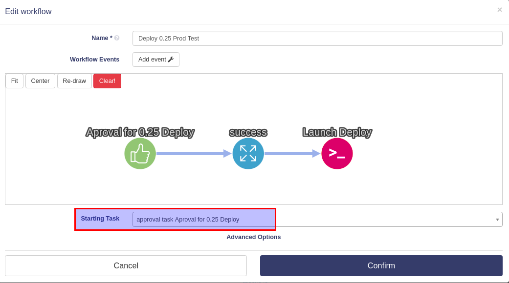

# Task Triggers

En TheEye se pueden lanzar tareas de diversas maneras; se pueden ejecutar directamente desde la app con el botón Play, se pueden ejecutar mediante un request a la API, se pueden ejecutar como parte de un workflow, o se pueden ejecutar usando _disparadores_ (triggers)  .

### Tareas disparadas por otras tareas

Cuando una tarea dispara a otra, su output puede usarse como input de la tarea que está disparando, siempre y cuando coincidan los outputs de la tarea disparadora con los inputs de la tarea disparada.

En este ejemplo, se usa el evento `success` de la tarea _"Get Stalled Transaction"_ para disparar la tarea _"Excecute Transation"_. El parámetro **#0** _"Transaction Number"_ se recibe del output de la tarea disparadora. La opción **Triggered by** determina el evento que disparará automáticamente la tarea, en este caso el evento `success` de la tarea _"Get Stalled Transaction"_.

Cuando la tarea _"Get Stalled Transaction"_ finaliza la ejecución **correctamente**, se lanzará la tarea _"Execute Transaction"_. la data del output de _"Get Stalled Transaction"_ se usa como input.

Para usar esta función, escribe tu script empezando con el ejemplo incluido. Puede cargar el ejemplo con el botón **"Load Example"** en el editor de texto online de TheEye.

### Tareas disparadas por monitores

Los monitores pueden usarse para disparar tareas igual que los eventos de tareas. Para hacer esto, selecciona el monitor en la opcion **Triggered by**.

Si el output del monitor es necesaria para la tarea que se quiere lanzar, necesitarás usar un script como se muestra en los ejemplos. Siempre puedes ver un ejemplo en el editor de texto online de TheEye.

<!-- TODO: Agregar ejemplo acá -->

### Tareas disparadas por Workflows

Workflows triggers the task that is set as Starting Task, as shown below.

Los Workflows son cadenas de varias tareas conectadas entre sí, y se usan para simplificar el uso de disparadores. Usando Workflows, la parametrización de disparadores se hace automáticamente, y solo se debe configura la tarea inicial, la cual se ejecutará primero cuando se ejecute el Workflow. [Más información](./workflows.md)

 

