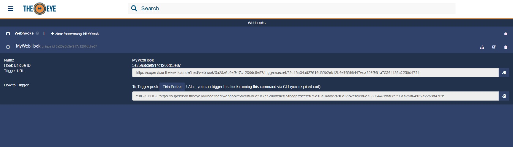
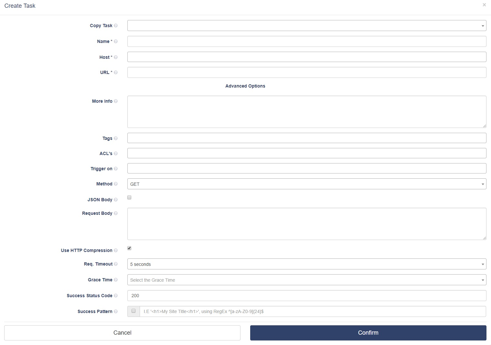

# Webhooks

## Trabajar con Webhooks

Un Webhook en TheEye es un método de alterar o aumentar el comportamiento de los Workflows o Scripts, usando callbacks externos que pueden estar mantenidos y administrados por usuarios de terceros o developers que pueden no estar afiliados con los desarrolladores originales de la aplicación o página web

### Incoming Webhooks

Los Webhooks se pueden usar para realizar acciones cuando ocurre un evento en una página externa. Cuando ocurre el evento, el sitio fuente hace un request HTTP a la URL configurada para el Webhook

Para crear un Webhook, puede pulsar el botón **+** y en la lista de opciones seleccione _Webhook_. Para ver sus Webhooks, diríjase a la pestaña de _Webhooks_ en el menú de la izquierda; ahí verá la lista de los webhooks creados, y puede cliquear en uno para expandirlo y ver la URL asignada al mismo, al igual que el ejemplo de `curl` que puede usar para dispararlo.

The webhook you created can be used as a trigger for other resources \(e.g. You can set the webhook to be the trigger of a task\) as shown hereunder.
El Webhook creado puede usarse para disparar otros recursos (Ej. Un Webhook puede configurarse como el trigger de una tarea)

<!-- TODO: Cambiar imagen, esta está en modo oscuro, cosa que TheEye no tiene de momento -->

### Tarea de request Webhook/HTTP saliente

Selecciona la opción _Outgoing Webhook/HTTP Request_ en el diálogo de crear tarea para crear tareas de request HTTP.

Las opciones de los las tareas de tipo _Outgoing Webhook/HTTP Request_ son las siguientes:

- **Name:** Nombre de la tarea
- **Bots:** El Bot que ejecutará la tarea
- **URL**: La URL a la que enviar el request. Si desea usar los métodos `GET` o `POST`, la querystring debe etar incluida en la URL (Ej. _https://www.mysite.com?foo=foo&bar=bar_)
- **Tags:** Etiquetas para facilitar la busqueda de tasks (opcional)
- **Advanced options** _(Click para desplegar)_
  - **Copy Task:** Puedes elegir una tarea y clonar sus opciones (opcional)
  - **Description:** Breve descripción de la tarea (opcional)
  - **ACL's:** Asignar permisos de ACL a otros usuarios (opcional). [Más información](./iam/user-management.md)
  - **Triggered by:** Eventos que dispararán la tarea automáticamente (opcional)
  - **Trigger on-hold time:** Tiempo desde uno de los eventos definidos anteriormente hasta el disparo de la tarea (opcional)
  - **Method**:  El método del request (`GET`, `POST`, `PUT`, `DELETE`, etc)
  - **JSON Body**: Incluir o no un cuerpo de tipo `JSON` en el request
  - **Request Body**: Los datos a enviar en el cuerpo `JSON` del request (solo si la opcion previa está activada)
  - **Use HTTP Compression**: Habilitar o no la compresión HTTP
  - **Req. timeout:** Cuánto esperar la respuesta del servidor antes de considerar el request como fallido (opcional)
  - **Success Status Code**: El código HTTP esperado como respuesta para considerarse exitosa. [Más información](https://www.w3.org/Protocols/rfc2616/rfc2616-sec10.html)
  - **Success Pattern**:  El cuerpo de la respuesta HTTP esperada. Puede escribir código HTML o usar una _Expresión Regular_ (opcional)
  - **Multitasking:** Permite a los Bots ejecutar multiples Jobs de esta tarea en paralelo
