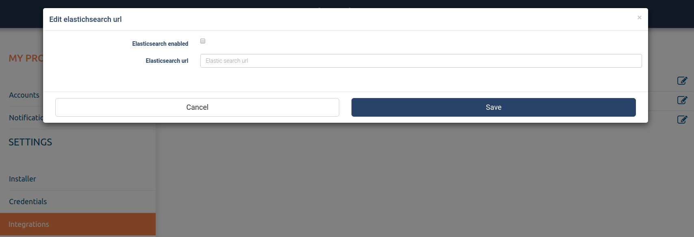
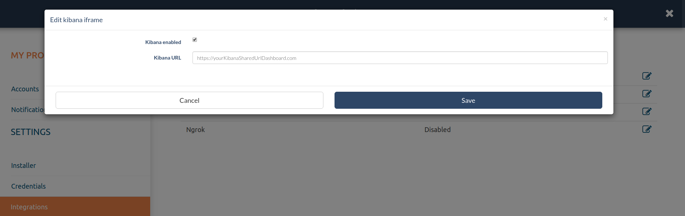

# Theeye Integrations

## TheEye Traceability - Elasticsearch (part of ELK stack)

** Steps for activating Elasticsearch integration **

- Go to Settings, then Integrations, activate Elasticsearch.
- Configure the URL of the service.
- Check that Elasticsearch is receiving information.

## TheEye Official Dashboard - Compatible with Kibana 6.7.2

** Steps of activation Kibana Dashboard **

- Elasticsearch integration enabled (previous step)
- Go to Settings > Integrations activate Kibana.
- In both cases you must configure the URL of the services.
- Check that Elasticsearch is receiving information.
- Then import (kibanaTheEyeDefaultDashboard.json) to display the official dashboard kibanaTheEye.

[json Kibana](../../assets/kibanaTheEyeDefaultDashboard.json)

https://kibana.theeye.io

