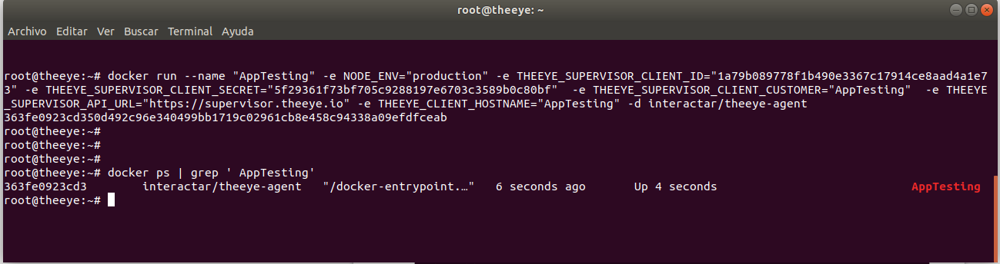
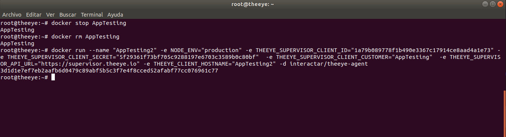
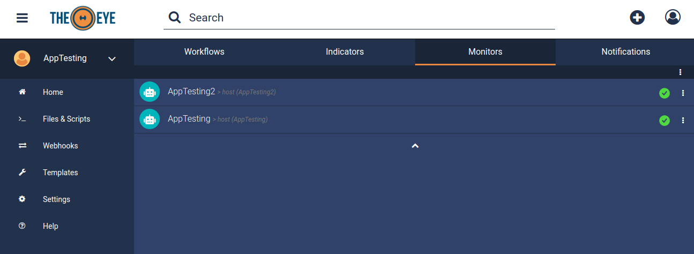

# TheEye Troubleshooting

This page provides troubleshooting to the most common issues about TheEye.

## INSTALL AGENT

### DUPLICATE THEEYE_CLIENT_HOSTNAME

The **Agent** won't install correctly, if the parameter name "THEEYE_CLIENT_HOSTNAME" is equal to any existing **Hostname** on the  **Organization**.

If you have installed the **Agent** on **Docker**, you must remove the image and reinstall it with a different **Hostname**.

Example:

In this case, the **Organization**  already has a **Bot** with the **hostname** AppTesting

If you try to install an **Agent** with the same **Hostname** on **Docker**, you will see the image locally installed and running correctly, but you won't see it reflected in the **Dashboard**

You must stop and remove the image, then reinstall it with a different **Hostname**, and you'll see the bot installed correctly in the **Dashboard**.

